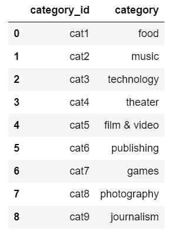
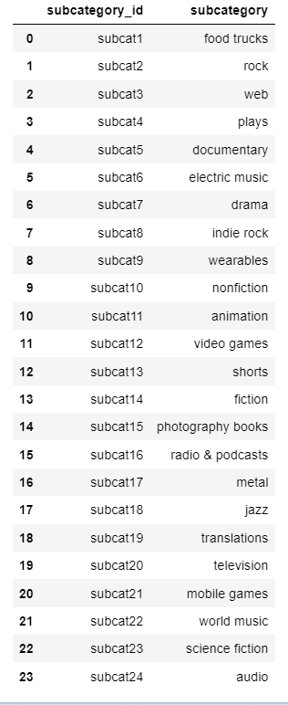
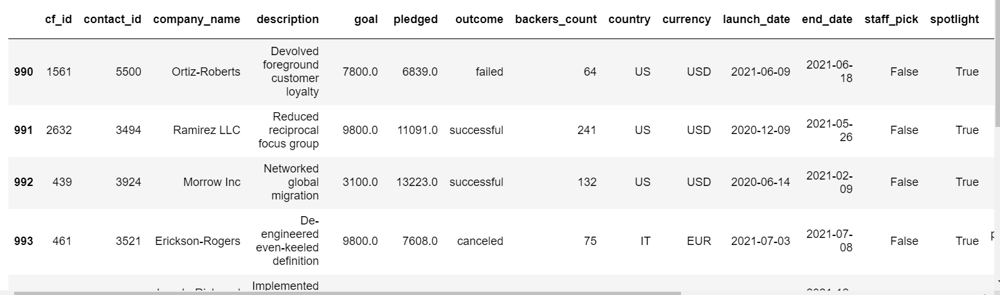
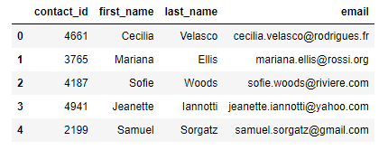
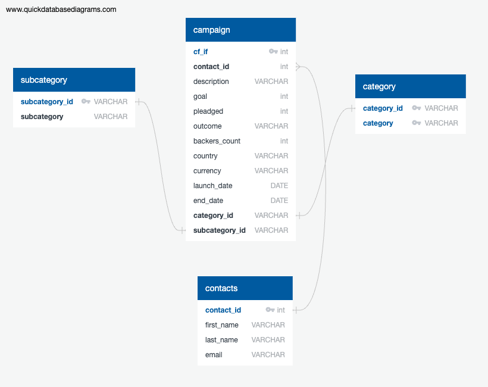

# Crowdfunding_ETL

Project Collaborators "The Cool Cat Coders": Taniya Talukdar, Matty Donovan, Saroja Shrestha, Veronica Mueller

Data Sources: crowdfunding.xlsx & contacts.xlsx

<ins>Crowdfunding Analysis</ins> 

At the start of the project, we extracted the crowdfunding.xlsx data and read it into a DataFrame using pandas & numpy. After splitting 'category' and 'subcategory' into two different columns, we found that there are almost three times as many subcategories as categories.

<ins>Campaign DataFrame</ins>

*CRUD*

For this part of the project, we followed the CRUD process to prepare the Campaign DataFrame We renamed some of the columns, converted the 'goal' and 'pledged' columns to float and formatted the launch_date and end_date columns to datetime. We found it interesting that the original number for the launch_date adn end_date had seconds as their unit so we had to include this parameter in our code so that the correct dates would be counted. We also were able to drop the unwanted columns and export the data to a CSV file.

<ins>Contacts DataFrame</ins>

We chose option 2 using regex because we are aware how pandas works and we wanted to practice using the new regex skills. We faced a challenge creating the pattern for the regex as this was our first attempt using these skills. We changed the data type for the contact_id column, extracted the email addresses, first and last names into their own columns. Finally, to clean up the data, we dropped uneccessary columns and reordered the information.

<ins>ERD & Sql Databases<ins>
  
  
For the ER Diagram, we first created the Sql DB tables. We quickly identified that the Campaign table would give us a variety of relationships to connect to (Foreign Keys) and thus we identified our primary key within this table (cf_id). As you can see from the ER Diagram contact id, subcategory_id were amongst some of the foreign keys identified.

 
~The Cool Cat Coders

