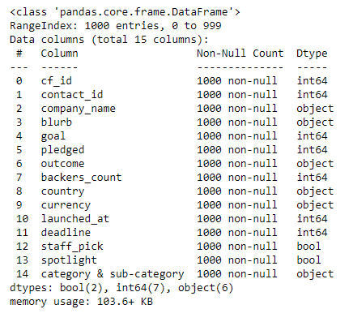

# Crowdfunding_ETL

Project Collaborators: Taniya Talukdar, Matty Donovan, Saroja Shrestha, Veronica Mueller

<ins>Crowdfunding Analysis</ins> 

At the start of the project, we extracted the crowdfunding.xlsx data and read it into a DataFrame using pandas & numpy. Next, we got a brief summary of the crowdfunding_info DataFrame as shown in Figure 1.

Next, we split 'category' and 'subcategory' into two different columns and created lists of each of these values. We were able to use the lists to get the number of distinct values in each column and assign id numbers to each category and subcategory.

Finally, we were able to export both of these DataFrames as CSV files.

<ins>Campaign DataFrame</ins>

*CRUD*

For this part of the project,we made a copy of the crowdfunding information and created a new DataFrame. We renamed some of the columns, converted the 'goal' and 'pledged' columns to float and formatted the launch_date and end_date columns to datetime. We also were able to drop the unwanted columns and export the data to a CSV file.

<ins>Contacts DataFrame</ins>
